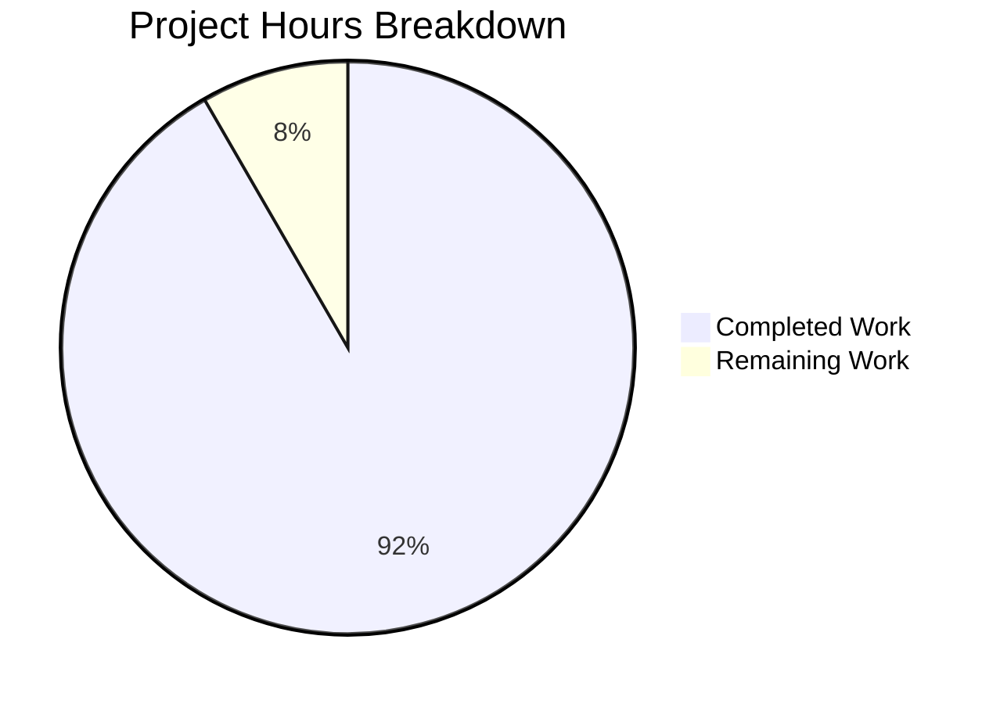
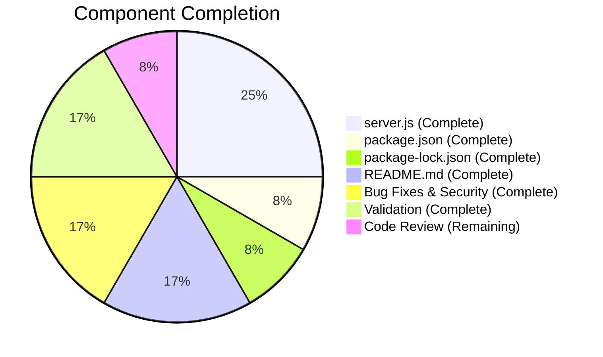

# Project Guide — Express.js Integration for hao-backprop-test

## 1. Executive Summary

**Project Completion: 92% (5.5 hours completed out of 6 total hours)**

This project successfully migrated a bare Node.js `http` module server to Express.js and added a new `GET /evening` endpoint. All 4 in-scope files were modified, validated, and committed across 6 clean commits. The server compiles without errors, all endpoints respond correctly at runtime, and npm audit reports zero vulnerabilities.

**Key Achievements:**
- Complete Express.js framework integration replacing the raw `http` module
- Two fully functional endpoints: `GET /` ("Hello, World!\n") and `GET /evening` ("Good evening")
- Express 5.2.1 installed with 66 packages and 0 vulnerabilities
- Security hardening: `X-Powered-By` header disabled
- Comprehensive README documentation with endpoint table, installation, and run instructions
- `package.json` corrected (`main` field, `start` script, dependency declaration)

**Remaining Work (0.5 hours):**
- Code review and PR merge approval by a human developer

**Completion Calculation:**
- Completed hours: 5.5h (1.5h server.js rewrite + 0.5h package.json + 0.5h package-lock.json + 1h README + 0.5h security fix + 0.5h content-type fix + 1h validation)
- Remaining hours: 0.5h (code review and merge)
- Total project hours: 6h
- Completion: 5.5 / 6 = **92%**

---

## 2. Validation Results Summary

### 2.1 Compilation Results — 100% SUCCESS
| File | Check | Result |
|------|-------|--------|
| `server.js` | `node -c server.js` syntax check | ✅ PASSED |
| `package.json` | JSON parse validation | ✅ PASSED |
| `package-lock.json` | Valid lockfileVersion 3, full dependency tree | ✅ PASSED |
| `README.md` | Valid markdown with endpoint documentation | ✅ PASSED |

### 2.2 Dependency Installation — 100% SUCCESS
- `npm install` completed: 66 packages installed, 0 vulnerabilities
- `express@5.2.1` confirmed installed and importable via `require('express')`
- `npm audit`: 0 vulnerabilities found
- All transitive dependencies resolved (accepts, body-parser, router, cookie, debug, etag, mime-types, proxy-addr, qs, send, etc.)

### 2.3 Runtime Validation — 100% SUCCESS
| Endpoint | Status | Content-Type | Body | Result |
|----------|--------|--------------|------|--------|
| `GET /` | 200 OK | `text/plain; charset=utf-8` | `Hello, World!\n` | ✅ PASS |
| `GET /evening` | 200 OK | `text/plain; charset=utf-8` | `Good evening` | ✅ PASS |
| `GET /unknown` | 404 Not Found | `text/html; charset=utf-8` | Express default 404 | ✅ PASS |

### 2.4 Security Validation
- `X-Powered-By` header: **Disabled** (not present in response headers) ✅
- `npm audit`: **0 vulnerabilities** ✅

### 2.5 Fixes Applied During Validation
| Commit | Fix Description |
|--------|----------------|
| `1bd7689` | Set explicit `Content-Type: text/plain` via `res.type('text')` on both route handlers |
| `941bb9f` | Disabled `X-Powered-By` header via `app.disable('x-powered-by')` to prevent framework disclosure |

### 2.6 Test Results
- `npm test` exits with code 1 — this is the **pre-existing placeholder** test script (`echo "Error: no test specified" && exit 1`) that was explicitly **OUT OF SCOPE** per AAP §0.6.2. No test framework or test files exist in the repository, and the user did not request test coverage.

### 2.7 Git Status — CLEAN
- 6 commits on branch `blitzy-63de7682-29f2-4d3e-9441-621af6c65794`
- 4 files changed: 875 insertions, 14 deletions
- All in-scope files committed with descriptive messages
- `node_modules/` correctly untracked

---

## 3. Visual Representation

### Hours Breakdown


### Completion by Component


---

## 4. AAP Requirements vs Implementation

| # | AAP Requirement | Status | Verification |
|---|----------------|--------|--------------|
| 1 | Replace bare `http` module with Express.js | ✅ Complete | `server.js` uses `require('express')` and `express()` app |
| 2 | `GET /` returns `Hello, World!\n` | ✅ Complete | Runtime verified: 200 OK, `text/plain`, exact body match |
| 3 | `GET /evening` returns `Good evening` | ✅ Complete | Runtime verified: 200 OK, `text/plain`, exact body match |
| 4 | Server listens on port 3000 | ✅ Complete | Runtime verified: `Server running at http://localhost:3000/` |
| 5 | Add `express@^5.2.1` to dependencies | ✅ Complete | `package.json` contains `"express": "^5.2.1"` |
| 6 | Regenerate `package-lock.json` | ✅ Complete | 814 lines, lockfileVersion 3, full dependency tree |
| 7 | Add `start` script to package.json | ✅ Complete | `"start": "node server.js"` |
| 8 | Correct `main` field to `server.js` | ✅ Complete | Changed from `index.js` to `server.js` |
| 9 | Update README.md with endpoint docs | ✅ Complete | 40 lines with endpoint table, install/run instructions |
| 10 | Maintain CommonJS `require()` syntax | ✅ Complete | `const express = require('express');` |
| 11 | Preserve flat file structure | ✅ Complete | 4 files, no new directories |
| 12 | Tutorial-friendly, clear code | ✅ Complete | Standard Express idioms with inline comments |
| 13 | Minimal dependency footprint | ✅ Complete | Only `express` added, no additional packages |
| 14 | Unmatched routes return 404 | ✅ Complete | Express default 404 for unknown paths |

**All 14 requirements verified and complete.**

---

## 5. Detailed Task Table — Remaining Work

| # | Task | Description | Priority | Severity | Hours | Confidence |
|---|------|-------------|----------|----------|-------|------------|
| 1 | Code Review & PR Merge | Review all 4 changed files, verify Express.js patterns match team standards, approve and merge the pull request | Medium | Low | 0.5h | High |
| | **Total Remaining Hours** | | | | **0.5h** | |

**Verification:** Task table total (0.5h) = Pie chart "Remaining Work" (0.5h) ✅

**Note:** All functional implementation, bug fixes, security hardening, dependency installation, documentation, and runtime validation have been completed by the agents. The sole remaining task is human code review before merge.

---

## 6. Development Guide

### 6.1 System Prerequisites

| Software | Minimum Version | Verified Version |
|----------|----------------|-----------------|
| Node.js | v18.0.0+ | v20.19.5 |
| npm | v7.0.0+ | v10.8.2 |

### 6.2 Environment Setup

Clone the repository and switch to the feature branch:

```bash
git clone <repository-url>
cd hao-backprop-test
git checkout blitzy-63de7682-29f2-4d3e-9441-621af6c65794
```

No environment variables or external services are required. The server runs entirely in-process with no database, cache, or external dependencies.

### 6.3 Dependency Installation

Install all npm dependencies:

```bash
npm install
```

**Expected output:**
```
added 66 packages, and audited 67 packages in Xs
found 0 vulnerabilities
```

**Verification:**
```bash
node -e "console.log(require('express/package.json').version)"
# Expected: 5.2.1
```

### 6.4 Application Startup

Start the server using npm:

```bash
npm start
```

Or directly with Node.js:

```bash
node server.js
```

**Expected output:**
```
Server running at http://localhost:3000/
```

### 6.5 Verification Steps

Test both endpoints with curl:

```bash
# Test root endpoint
curl http://localhost:3000/
# Expected: Hello, World!

# Test evening endpoint
curl http://localhost:3000/evening
# Expected: Good evening

# Verify 404 for unknown routes
curl -s -o /dev/null -w "%{http_code}" http://localhost:3000/unknown
# Expected: 404

# Verify X-Powered-By is disabled
curl -sI http://localhost:3000/ | grep -i x-powered-by
# Expected: no output (header not present)
```

### 6.6 Syntax Validation

```bash
node -c server.js
# Expected: no output (success)
```

### 6.7 Troubleshooting

| Issue | Cause | Solution |
|-------|-------|---------|
| `Error: Cannot find module 'express'` | Dependencies not installed | Run `npm install` |
| `EADDRINUSE: address already in use :::3000` | Port 3000 occupied | Kill the process using port 3000: `lsof -ti:3000 \| xargs kill` |
| `node: command not found` | Node.js not installed | Install Node.js v18+ from https://nodejs.org |

---

## 7. Risk Assessment

### 7.1 Technical Risks

| Risk | Severity | Likelihood | Mitigation |
|------|----------|------------|------------|
| No automated test coverage | Low | N/A | Explicitly out of scope per user request (AAP §0.6.2). Add tests if project grows beyond tutorial scope. |
| Hardcoded port 3000 | Low | Low | Acceptable for tutorial project. Use `process.env.PORT \|\| 3000` if deploying to production. |
| No input validation middleware | Low | Low | Current endpoints serve static responses with no user input. Add validation if dynamic endpoints are introduced. |

### 7.2 Security Risks

| Risk | Severity | Likelihood | Mitigation |
|------|----------|------------|------------|
| No HTTPS | Low | Low | Tutorial project on localhost. Use a reverse proxy (nginx) or HTTPS termination in production. |
| No rate limiting | Low | Low | Not needed for tutorial scope. Add `express-rate-limit` if exposed publicly. |
| X-Powered-By disabled | Mitigated | N/A | Already addressed by `app.disable('x-powered-by')` in commit `941bb9f`. |

### 7.3 Operational Risks

| Risk | Severity | Likelihood | Mitigation |
|------|----------|------------|------------|
| No process manager | Low | Low | Tutorial project. Use PM2 or systemd for production deployments. |
| No health check endpoint | Low | Low | Not required for tutorial scope. Add `GET /health` if monitoring is needed. |
| No logging framework | Low | Low | Console.log is sufficient for tutorial. Add `morgan` or `winston` for production. |

### 7.4 Integration Risks

| Risk | Severity | Likelihood | Mitigation |
|------|----------|------------|------------|
| No external integrations | None | N/A | Project is self-contained with no external service dependencies. |

**Overall Risk Level: LOW** — This is a minimal tutorial project with no external dependencies, no user input processing, and no persistent state. All identified risks are appropriate for the tutorial context and explicitly out of scope per the AAP.

---

## 8. Commit History

| Hash | Author | Message |
|------|--------|---------|
| `51d1e67` | Blitzy Agent | chore: add express@^5.2.1 as production dependency |
| `78e84cc` | Blitzy Agent | Update package.json: fix main field to server.js, add start script, update description for Express.js |
| `78bd6ed` | Blitzy Agent | Migrate server.js from bare http module to Express.js with GET / and GET /evening routes |
| `1bd7689` | Blitzy Agent | fix: set Content-Type to text/plain for both route handlers |
| `dfa269c` | Blitzy Agent | docs: update README.md with Express.js integration documentation |
| `941bb9f` | Blitzy Agent | fix(security): disable X-Powered-By header to prevent framework disclosure |

---

## 9. File Change Summary

| File | Lines Added | Lines Removed | Net Change | Status |
|------|------------|---------------|------------|--------|
| `server.js` | 14 | 9 | +5 | UPDATED |
| `package.json` | 8 | 4 | +4 | UPDATED |
| `package-lock.json` | 814 | 0 | +814 | REGENERATED |
| `README.md` | 39 | 1 | +38 | UPDATED |
| **Total** | **875** | **14** | **+861** | |
