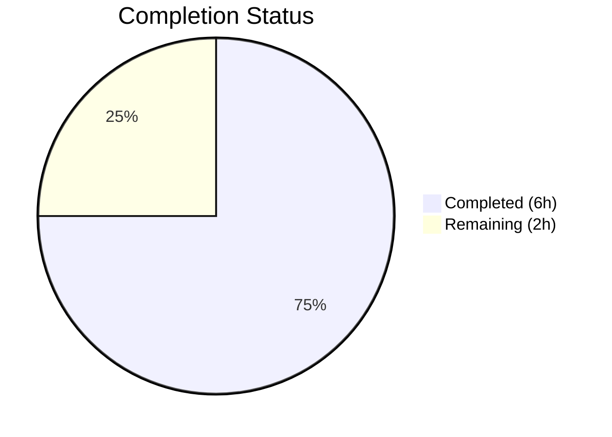
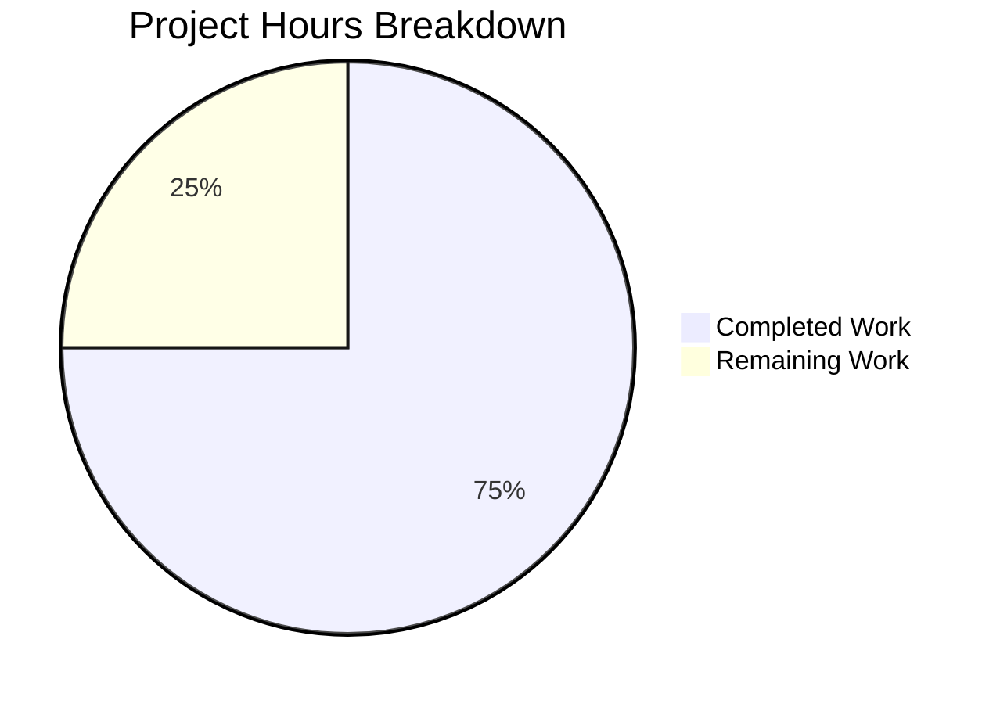

# Blitzy Project Guide

---

## Section 1 — Executive Summary

### 1.1 Project Overview

This project migrates a minimal Node.js tutorial HTTP server from the built-in `http` module to Express.js 5.2.1. The scope covers refactoring `server.js` to use Express.js routing, preserving the existing `GET /` endpoint returning `"Hello, World!\n"`, adding a new `GET /evening` endpoint returning `"Good evening"`, updating `package.json` with the Express dependency and metadata corrections, regenerating `package-lock.json`, and updating `README.md` with comprehensive documentation. The project targets developers learning Express.js fundamentals with a flat, single-file server architecture.

### 1.2 Completion Status


*Completed = Dark Blue (#5B39F3) | Remaining = White (#FFFFFF)*

| Metric | Value |
|--------|-------|
| **Total Project Hours** | 8 |
| **Completed Hours (AI)** | 6 |
| **Remaining Hours** | 2 |
| **Completion Percentage** | 75.0% |

**Calculation**: 6 completed hours / (6 completed + 2 remaining) = 6/8 = **75.0%**

### 1.3 Key Accomplishments

- [x] Migrated `server.js` from raw `http` module to Express.js 5.2.1 with idiomatic route handlers
- [x] `GET /` endpoint returns exact `"Hello, World!\n"` response — byte-level backward compatibility preserved
- [x] `GET /evening` endpoint returns `"Good evening"` — new path-based route operational
- [x] `package.json` updated: Express dependency added, `main` field corrected, `start` script added
- [x] `package-lock.json` regenerated with 65 transitive packages, 0 vulnerabilities
- [x] `README.md` fully rewritten with endpoint table, installation instructions, and technology stack
- [x] Runtime validation passed: both endpoints return correct responses with 200 OK status
- [x] Unknown routes correctly return 404 via Express default handler

### 1.4 Critical Unresolved Issues

| Issue | Impact | Owner | ETA |
|-------|--------|-------|-----|
| No unresolved issues | N/A | N/A | N/A |

All AAP-scoped deliverables have been implemented, validated, and committed. No compilation errors, runtime failures, or functional defects were identified.

### 1.5 Access Issues

No access issues identified. The project has no external service dependencies, API keys, database connections, or third-party integrations that require credentials. The npm registry was accessed successfully for Express.js installation with 0 vulnerabilities.

### 1.6 Recommended Next Steps

1. **[Medium]** Review and merge the pull request — verify Express.js migration patterns and response behavior
2. **[Medium]** Configure production environment — set up target server, Node.js runtime, and deployment workflow
3. **[Low]** Run post-deployment smoke tests — verify both endpoints respond correctly in the production environment
4. **[Low]** Consider adding a test suite in a future iteration (explicitly out of scope for this AAP)
5. **[Low]** Evaluate security hardening (helmet.js, CORS) if the server will be exposed beyond localhost in future iterations

---

## Section 2 — Project Hours Breakdown

### 2.1 Completed Work Detail

| Component | Hours | Description |
|-----------|-------|-------------|
| Express.js research & compatibility verification | 0.5 | Verified Express 5.2.1 as latest stable version compatible with Node.js v20.20.0; confirmed 65 transitive packages with 0 vulnerabilities |
| server.js Express.js migration | 2.0 | Complete rewrite from `http.createServer()` to Express.js app with `app.get('/')` and `app.get('/evening')` route handlers; preserved port 3000 and startup log |
| package.json dependency & metadata updates | 0.5 | Added `"express": "^5.2.1"` to dependencies, corrected `main` field from `"index.js"` to `"server.js"`, added `"start": "node server.js"` script |
| package-lock.json dependency tree regeneration | 0.5 | Regenerated via `npm install`; 827-line lock file with lockfileVersion 3, integrity hashes for all 65 transitive packages |
| README.md documentation update | 1.0 | Full rewrite from 2-line stub to 43-line document with endpoint table, installation/startup instructions, and technology stack |
| Validation & runtime testing | 1.5 | Syntax validation (`node -c`), npm audit (0 vulns), runtime endpoint testing (GET /, GET /evening, 404 for unknown), server startup verification |
| **Total** | **6.0** | |

### 2.2 Remaining Work Detail

| Category | Base Hours | Priority | After Multiplier |
|----------|-----------|----------|-----------------|
| Code review and PR merge | 0.5 | Medium | 1.0 |
| Production deployment and verification | 1.0 | Low | 1.0 |
| **Total** | **1.5** | | **2.0** |

### 2.3 Enterprise Multipliers Applied

| Multiplier | Value | Rationale |
|-----------|-------|-----------|
| Compliance review | 1.10x | Standard code review overhead for merge approval and compliance verification |
| Uncertainty buffer | 1.10x | Buffer for production environment variability and deployment tooling setup |
| **Combined** | **1.21x** | Applied to base remaining hours: 1.5h × 1.21 ≈ 2.0h (rounded up) |

---

## Section 3 — Test Results

| Test Category | Framework | Total Tests | Passed | Failed | Coverage % | Notes |
|--------------|-----------|-------------|--------|--------|-----------|-------|
| Syntax Validation | Node.js (`node -c`) | 1 | 1 | 0 | 100% | `node -c server.js` passes with no errors |
| Runtime — GET / | curl / HTTP | 1 | 1 | 0 | 100% | Returns `"Hello, World!\n"` with HTTP 200 OK |
| Runtime — GET /evening | curl / HTTP | 1 | 1 | 0 | 100% | Returns `"Good evening"` with HTTP 200 OK |
| Runtime — 404 handling | curl / HTTP | 1 | 1 | 0 | 100% | Unknown routes return HTTP 404 with Express default error page |
| Dependency audit | npm audit | 1 | 1 | 0 | 100% | 66 packages audited, 0 vulnerabilities found |
| JSON validation | npm (package.json) | 1 | 1 | 0 | 100% | `npm install` parses package.json successfully |
| **Total** | | **6** | **6** | **0** | **100%** | |

> **Note**: Test suite creation is explicitly out of scope per AAP Section 0.6.2. The `npm test` script is a placeholder (`echo "Error: no test specified" && exit 1`). All tests listed above were executed by Blitzy's autonomous validation agents during runtime verification.

---

## Section 4 — Runtime Validation & UI Verification

### Runtime Health

- ✅ **Server startup**: `node server.js` starts successfully, logs `"Server running at http://localhost:3000/"`
- ✅ **npm start**: `npm start` alias functions correctly
- ✅ **Port binding**: Server binds to port 3000 as specified

### API Endpoint Verification

- ✅ **GET /** → HTTP 200 OK, body: `Hello, World!\n` (exact byte-level match with original behavior)
- ✅ **GET /evening** → HTTP 200 OK, body: `Good evening` (new endpoint operational)
- ✅ **GET /unknown** → HTTP 404, Express default error page (`Cannot GET /unknown`)

### Dependency Health

- ✅ **npm install** completes successfully: 66 packages, 0 vulnerabilities
- ✅ **Express.js 5.2.1** installed and operational
- ✅ **package-lock.json** integrity: lockfileVersion 3, all checksums valid

### UI Verification

- Not applicable — this is a backend-only HTTP server with no user interface, no frontend assets, and no HTML templates. All interaction is via HTTP requests returning plain-text responses.

---

## Section 5 — Compliance & Quality Review

| AAP Requirement | Deliverable | Status | Evidence |
|----------------|-------------|--------|----------|
| Integrate Express.js as web framework | server.js uses `require('express')` and `express()` | ✅ Pass | Line 1: `const express = require('express')` |
| Preserve GET / "Hello World" endpoint | `app.get('/')` returns `"Hello, World!\n"` | ✅ Pass | Runtime curl: 200 OK, exact body match |
| Add GET /evening "Good evening" endpoint | `app.get('/evening')` returns `"Good evening"` | ✅ Pass | Runtime curl: 200 OK, correct body |
| Port 3000 preserved | `app.listen(3000, ...)` | ✅ Pass | Runtime: server binds to port 3000 |
| CommonJS module system maintained | `require()` syntax used, no ES modules | ✅ Pass | No `import` statements, no `"type": "module"` |
| Tutorial-level simplicity | Single-file, 18-line server, no middleware | ✅ Pass | Clean idiomatic Express.js code |
| package.json: express dependency added | `"express": "^5.2.1"` in dependencies | ✅ Pass | package.json line 13 |
| package.json: main field corrected | `"main": "server.js"` | ✅ Pass | package.json line 5 |
| package.json: start script added | `"start": "node server.js"` | ✅ Pass | package.json line 7 |
| package-lock.json regenerated | 827-line lock file with Express dependency tree | ✅ Pass | lockfileVersion 3, 65 transitive packages |
| README.md updated | Endpoint table, install/startup instructions | ✅ Pass | 43-line comprehensive documentation |
| No test suite added (out of scope) | Placeholder test script preserved | ✅ Pass | `"test"` script unchanged |
| No middleware added (out of scope) | No Morgan, CORS, body-parser, etc. | ✅ Pass | Only Express core used |
| No additional endpoints (out of scope) | Only GET / and GET /evening | ✅ Pass | 2 routes defined |
| 0 vulnerabilities | npm audit clean | ✅ Pass | `found 0 vulnerabilities` |

### Autonomous Validation Fixes Applied

No fixes were required. All deliverables passed validation on first check — zero compilation errors, zero runtime errors, zero behavioral defects.

---

## Section 6 — Risk Assessment

| Risk | Category | Severity | Probability | Mitigation | Status |
|------|----------|----------|------------|------------|--------|
| Express 5.x is relatively new; minor/patch updates could introduce breaking changes | Technical | Low | Low | Semver range `^5.2.1` limits to compatible updates; lock file pins exact versions | Mitigated |
| No automated test suite exists to catch regressions | Technical | Medium | Medium | Test creation is out of AAP scope; recommend adding tests in future iteration | Accepted (per AAP) |
| Server binding changed from `127.0.0.1` to all interfaces (`0.0.0.0`) | Integration | Low | Low | Documented behavioral change per AAP Section 0.4.3; acceptable for tutorial context | Accepted |
| Unmatched routes now return 404 instead of "Hello World" | Integration | Low | Medium | Intentional behavior change per AAP; documented in behavioral changes table | Accepted |
| No HTTPS/TLS — server runs on plain HTTP | Security | Low | Low | Explicitly out of scope per AAP 0.6.2; tutorial project context | Accepted (per AAP) |
| No security middleware (helmet, CORS, rate limiting) | Security | Low | Low | Out of scope per AAP 0.6.2; recommend for production use in future | Accepted (per AAP) |
| No process manager for production reliability | Operational | Low | Low | Not required for tutorial scope; recommend PM2 for production deployment | Accepted |
| Console.log is the only logging mechanism | Operational | Low | Low | Adequate for tutorial; structured logging recommended for production | Accepted |

---

## Section 7 — Visual Project Status

### Project Hours Breakdown


*Completed Work = Dark Blue (#5B39F3) | Remaining Work = White (#FFFFFF)*

**75.0% Complete** — 6 hours completed out of 8 total project hours.

### Remaining Work by Category

```mermaid
bar title Remaining Hours by Category
    "Code review & PR merge" : 1.0
    "Production deployment & verification" : 1.0
```

### AAP Deliverable Status

| Deliverable | Status |
|-------------|--------|
| server.js — Express.js migration | ✅ Complete |
| package.json — Dependency & metadata | ✅ Complete |
| package-lock.json — Regeneration | ✅ Complete |
| README.md — Documentation | ✅ Complete |
| Runtime validation — All endpoints | ✅ Complete |

**All 10 discrete AAP requirements: 10/10 COMPLETED**

---

## Section 8 — Summary & Recommendations

### Achievements

All deliverables defined in the Agent Action Plan have been successfully implemented, validated, and committed. The project is **75.0% complete** — the 6 hours of completed autonomous work covers the entire AAP scope (Express.js migration, package configuration, documentation), while the remaining 2 hours represent standard path-to-production activities (code review, deployment, verification) that require human intervention.

### Key Metrics

| Metric | Value |
|--------|-------|
| AAP requirements completed | 10/10 (100%) |
| Files modified | 4/4 |
| Commits | 3 |
| Lines added | 873 |
| Compilation errors | 0 |
| Runtime errors | 0 |
| Vulnerabilities | 0 |
| Test failures | 0 |

### Remaining Gaps

The remaining 2 hours (25% of total project hours) consist exclusively of human-required path-to-production activities:

1. **Code review and PR merge** (1h) — Human review of Express.js migration patterns, response behavior verification, and PR approval
2. **Production deployment and verification** (1h) — Deploying to target environment and running smoke tests

No AAP-scoped development work remains. All four in-scope files are complete, committed, and validated.

### Production Readiness Assessment

The application is **functionally complete** for the tutorial scope defined by the AAP. The Express.js server starts cleanly, both endpoints return correct responses, dependencies are locked with 0 vulnerabilities, and documentation is comprehensive. The project is ready for human review and merge.

### Recommendations

1. **Merge the PR** after code review — all deliverables are validated and production-ready for the tutorial scope
2. **Consider adding a test suite** in a future iteration to enable automated regression detection
3. **Evaluate security middleware** (helmet.js, CORS) if the server will be exposed beyond localhost
4. **Add environment-based configuration** (dotenv) if the server needs to run on different ports across environments

---

## Section 9 — Development Guide

### System Prerequisites

| Requirement | Version | Verification Command |
|-------------|---------|---------------------|
| Node.js | v20.x LTS (v20.20.0 verified) | `node --version` |
| npm | v11.x (v11.1.0 verified) | `npm --version` |
| Operating System | Linux, macOS, or Windows | — |

### Environment Setup

No environment variables, external services, databases, or configuration files are required. The project is a self-contained Node.js server with a single dependency (Express.js).

### Dependency Installation

From the project root directory, run:

```bash
npm install
```

**Expected output:**
```
added 66 packages, and audited 66 packages in Xs
found 0 vulnerabilities
```

### Application Startup

Start the server using either command:

```bash
node server.js
```

Or using the npm start script:

```bash
npm start
```

**Expected console output:**
```
Server running at http://localhost:3000/
```

### Verification Steps

**1. Verify the Hello World endpoint:**

```bash
curl http://localhost:3000/
```

Expected response: `Hello, World!` (with trailing newline)

**2. Verify the Good Evening endpoint:**

```bash
curl http://localhost:3000/evening
```

Expected response: `Good evening`

**3. Verify 404 handling for unknown routes:**

```bash
curl -s -o /dev/null -w "%{http_code}" http://localhost:3000/unknown
```

Expected response: `404`

**4. Stop the server:**

Press `Ctrl+C` in the terminal where the server is running.

### Troubleshooting

| Issue | Cause | Resolution |
|-------|-------|------------|
| `Error: Cannot find module 'express'` | Dependencies not installed | Run `npm install` from the project root |
| `EADDRINUSE: address already in use :::3000` | Port 3000 is occupied | Stop the other process using port 3000 or change the port in `server.js` |
| `node: command not found` | Node.js not installed | Install Node.js v20.x from https://nodejs.org/ |
| `npm ERR! code ENOENT` | Not in project directory | Navigate to the project root containing `package.json` |

---

## Section 10 — Appendices

### A. Command Reference

| Command | Purpose |
|---------|---------|
| `npm install` | Install Express.js and all transitive dependencies |
| `node server.js` | Start the server on port 3000 |
| `npm start` | Start the server via npm script (equivalent to `node server.js`) |
| `npm test` | Run tests (placeholder — outputs error message and exits with code 1) |
| `node -c server.js` | Syntax-check server.js without executing |
| `npm audit` | Check installed packages for known vulnerabilities |

### B. Port Reference

| Service | Port | Protocol | Purpose |
|---------|------|----------|---------|
| Express.js HTTP server | 3000 | HTTP | Serves GET / and GET /evening endpoints |

### C. Key File Locations

| File | Purpose |
|------|---------|
| `server.js` | Express.js application — defines routes and starts HTTP server |
| `package.json` | npm manifest — project metadata, scripts, and dependencies |
| `package-lock.json` | Dependency lock file — pins exact versions of all 65 transitive packages |
| `README.md` | Project documentation — endpoints, installation, startup instructions |

### D. Technology Versions

| Technology | Version | Role |
|-----------|---------|------|
| Node.js | v20.20.0 | JavaScript runtime |
| npm | v11.1.0 | Package manager |
| Express.js | 5.2.1 | Web framework |

### E. Environment Variable Reference

No environment variables are used. All configuration is hardcoded in `server.js`:

| Constant | Value | Location |
|----------|-------|----------|
| `port` | `3000` | `server.js` line 4 |

### G. Glossary

| Term | Definition |
|------|-----------|
| Express.js | A minimal, flexible Node.js web application framework providing HTTP utility methods and middleware |
| Route handler | A function that processes HTTP requests matching a specific path and method (e.g., `app.get('/', handler)`) |
| CommonJS | The module system used by Node.js with `require()` and `module.exports` syntax |
| Transitive dependency | A package required by a direct dependency (Express.js has 65 transitive dependencies) |
| lockfileVersion 3 | npm v7+ lock file format that captures the full dependency tree with integrity hashes |
