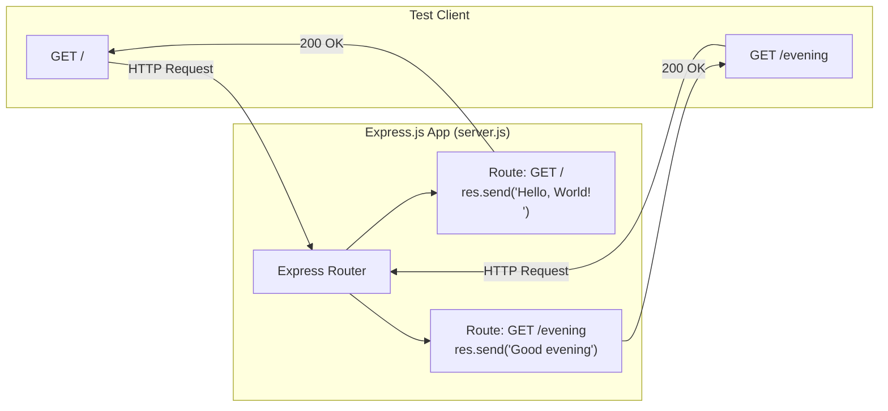

# Technical Specification

# 0. Agent Action Plan

## 0.1 Intent Clarification

### 0.1.1 Core Feature Objective

Based on the prompt, the Blitzy platform understands that the new feature requirement is to:

- **Integrate Express.js as the web framework**: Replace the existing bare Node.js `http` module server implementation in `server.js` with Express.js, introducing a proper routing framework to the currently zero-dependency project.
- **Preserve the existing "Hello World" endpoint**: The current endpoint that returns the response `"Hello, World!\n"` must continue to function identically after the migration to Express.js, maintaining backward compatibility for any existing consumers.
- **Add a new "Good evening" endpoint**: Create an additional HTTP endpoint that returns the response `"Good evening"` when accessed, introducing path-based routing to what is currently a single-handler, path-agnostic server.

Implicit requirements detected:

- The existing server binds to `127.0.0.1:3000` — this binding configuration should be preserved to avoid breaking any dependent integration test workflows.
- The `package.json` must be updated to declare Express.js as a dependency, transforming the project from a zero-dependency posture to one with a managed dependency.
- The `package-lock.json` will be regenerated to capture the full Express.js dependency tree.
- The `README.md` should be updated to reflect the new architecture and available endpoints.
- The `"main"` field in `package.json` currently points to the nonexistent `index.js` — this should be corrected to `server.js` as part of the integration effort.

### 0.1.2 Special Instructions and Constraints

- **Tutorial context**: The user explicitly describes this as a tutorial project. The implementation should prioritize clarity and simplicity, using idiomatic Express.js patterns that are straightforward to understand.
- **Maintain backward compatibility**: The existing `"Hello, World!\n"` response must remain accessible. The most natural mapping is to serve it at the root path `GET /`.
- **New endpoint path**: The user has not specified a path for the "Good evening" endpoint. Based on the tutorial context and the pattern of the existing endpoint, the new endpoint will be mapped to `GET /evening`.
- **No architectural requirements specified**: The user did not mandate any specific patterns (e.g., MVC, middleware chains, or modular routing). The implementation should follow the simplest Express.js conventions appropriate for a tutorial.

### 0.1.3 Technical Interpretation

These feature requirements translate to the following technical implementation strategy:

- To **integrate Express.js**, we will modify `server.js` to replace the `require('http')` import and `http.createServer()` pattern with `require('express')` and `express()` app initialization, then use `app.listen()` for server startup.
- To **preserve the "Hello World" endpoint**, we will create an `app.get('/', ...)` route handler that sends `"Hello, World!\n"` as a plain-text response, reproducing the exact current behavior for requests to the root path.
- To **add the "Good evening" endpoint**, we will create an `app.get('/evening', ...)` route handler that sends `"Good evening"` as a plain-text response on a dedicated path.
- To **update project metadata**, we will modify `package.json` to include `express` in the `dependencies` block, correct the `main` field to `server.js`, and add a `start` script for convenience.
- To **update documentation**, we will modify `README.md` to describe both endpoints and the Express.js integration.

## 0.2 Repository Scope Discovery

### 0.2.1 Comprehensive File Analysis

The repository is a minimal Node.js project located at the root with exactly four files, no subdirectories (excluding `.git`), and zero external dependencies. Every file in the repository is affected by this feature addition.

**Complete Repository File Inventory:**

| File | Type | Size | Current Purpose | Feature Impact |
|------|------|------|-----------------|----------------|
| `server.js` | Source | 342 B | HTTP server using built-in `http` module; single handler returning `"Hello, World!\n"` for all requests | **MODIFY** — Rewrite to use Express.js with route-based handlers |
| `package.json` | Config | 251 B | npm manifest; name `hello_world`, version `1.0.0`, zero dependencies, placeholder test script | **MODIFY** — Add `express` dependency, fix `main` field, add `start` script |
| `package-lock.json` | Lock | 247 B | Lock file confirming zero external packages (lockfileVersion 3) | **MODIFY** — Regenerated automatically by npm to include Express.js dependency tree |
| `README.md` | Docs | 73 B | Brief project description: "test project for backprop integration. Do not touch!" | **MODIFY** — Update to document Express.js integration and new endpoint |

**Existing modules to modify:**

- `server.js` — The sole runtime artifact. Currently imports `http`, creates a server with `http.createServer()`, hardcodes `hostname` and `port` constants, and binds via `server.listen()`. The entire request-handling logic (lines 6–10) must be replaced with Express.js route definitions.

**Configuration files to modify:**

- `package.json` — Must declare `express` in `dependencies`, correct the `"main": "index.js"` mismatch to `"main": "server.js"`, and add `"start": "node server.js"` to the `scripts` block.
- `package-lock.json` — Will be auto-regenerated by npm to reflect the full Express.js dependency graph (65 transitive packages as observed during installation).

**Documentation to modify:**

- `README.md` — Must be updated to describe the Express.js integration and both available endpoints.

### 0.2.2 Integration Point Discovery

- **API endpoints connecting to the feature**: The existing server has no routing — every HTTP method and path receives the same response. Express.js introduces path-based routing, requiring explicit route registration for both `GET /` (existing behavior) and `GET /evening` (new endpoint).
- **Database models/migrations affected**: None. The project has no database, ORM, or persistent storage of any kind.
- **Service classes requiring updates**: None. The project has no service layer, dependency injection, or modular architecture.
- **Controllers/handlers to modify**: The anonymous callback function in `server.js` (lines 6–10) currently acts as the universal handler. This will be replaced by Express.js route handler functions.
- **Middleware/interceptors impacted**: None exist currently. No middleware will be introduced as part of this minimal feature addition.

### 0.2.3 Web Search Research Conducted

- **Express.js latest stable version**: Confirmed via npm registry that Express.js `5.2.1` is the current latest version, published approximately 3 months ago. Express 5.x is now the default tag on npm.
- **Express 5.x Node.js compatibility**: Express 5 requires Node.js >= 18. The project environment runs Node.js v20.20.0, which is fully compatible.
- **Express 5.x key characteristics**: Supports native async/await error handling, uses `path-to-regexp@8.x` for route matching, and includes built-in promise rejection handling in middleware.

### 0.2.4 New File Requirements

No new source files need to be created. The tutorial-level scope of this feature is fully addressed by modifying the existing four files:

- `server.js` — Refactored to use Express.js (no new files needed for a two-route tutorial server)
- `package.json` — Updated with dependency and metadata corrections
- `package-lock.json` — Auto-regenerated
- `README.md` — Updated documentation

The project's minimal, flat-structure convention is preserved. No new directories, test files, configuration files, or module files are introduced.

## 0.3 Dependency Inventory

### 0.3.1 Private and Public Packages

The project transitions from a zero-dependency posture to a single direct dependency. The following table documents all packages relevant to this feature addition:

| Registry | Package Name | Version | Purpose | Status |
|----------|-------------|---------|---------|--------|
| npm | `express` | `^5.2.1` | Web framework providing routing, middleware, and HTTP utilities for defining the `/` and `/evening` endpoints | **New dependency** — to be added to `package.json` |
| Node.js built-in | `http` | Built-in (v20.20.0) | Previously used for raw HTTP server creation | **Removed** — replaced by Express.js internal HTTP handling |

**Version verification**: Express.js `5.2.1` was confirmed as the latest published version on the npm registry. Installation was verified in the Node.js v20.20.0 environment, resolving 65 transitive packages with zero vulnerabilities. The `^5.2.1` semver range in `package.json` will accept patch and minor updates within the 5.x line.

**Runtime dependencies**: Node.js v20.20.0 (LTS). No `.nvmrc` or `engines` field exists in the current `package.json` to enforce this version. The observed environment version is used as the verified baseline.

### 0.3.2 Dependency Updates

**Import Updates**

Files requiring import changes:

- `server.js` — Replace the Node.js built-in module import with the Express.js package import:
  - Old: `const http = require('http');`
  - New: `const express = require('express');`

No other files in the repository contain import statements. There are no test files, utility scripts, or additional source files that reference the `http` module.

**External Reference Updates**

- `package.json` — Add `dependencies` block containing `"express": "^5.2.1"`. Fix `"main"` field from `"index.js"` to `"server.js"`. Add `"start": "node server.js"` to `scripts`.
- `package-lock.json` — Fully regenerated to capture Express.js and its 65 transitive dependencies with integrity hashes.
- `README.md` — Update to reference Express.js usage and the `npm install` requirement.

No CI/CD configuration files exist (no `.github/workflows/*.yml`, no `.gitlab-ci.yml`, no `Jenkinsfile`). No build files such as `Dockerfile`, `docker-compose.yml`, or `.eslintrc` are present. No additional configuration or documentation files require dependency-related updates.

## 0.4 Integration Analysis

### 0.4.1 Existing Code Touchpoints

**Direct modifications required:**

- **`server.js` (lines 1–14, full file)**: The entire file must be refactored. The current implementation uses `http.createServer()` with a single anonymous callback that indiscriminately handles all requests. This must be replaced with an Express.js application that defines explicit route handlers. The key structural changes are:
  - Line 1: Replace `const http = require('http');` with `const express = require('express');`
  - Lines 3–4: The `hostname` and `port` constants may be retained or simplified. Express.js `app.listen()` accepts a port and optional callback, with hostname defaulting to all interfaces or configurable as a parameter.
  - Lines 6–10: Replace `http.createServer((req, res) => { ... })` with `app.get('/', ...)` and `app.get('/evening', ...)` route definitions.
  - Lines 12–14: Replace `server.listen(port, hostname, () => { ... })` with `app.listen(port, () => { ... })`.

- **`package.json` (lines 4–5, 7)**: Three modifications within the existing structure:
  - Line 5 (`"main"`): Change from `"index.js"` to `"server.js"` to correctly reference the actual entry point.
  - Line 7 (`"scripts"`): Add `"start": "node server.js"` alongside the existing `"test"` placeholder.
  - New block (`"dependencies"`): Add `"express": "^5.2.1"`.

- **`README.md` (full file)**: Replace the current 2-line content with updated documentation describing the Express.js-based server and its two endpoints.

**Dependency injections**: Not applicable. The project has no service container, dependency injection framework, or module registration system.

**Database/Schema updates**: Not applicable. The project has no database, no migrations directory, and no schema files.

### 0.4.2 Integration Flow

The following diagram illustrates how the modified `server.js` will handle requests after the Express.js integration:



### 0.4.3 Behavioral Changes

| Aspect | Before (http module) | After (Express.js) |
|--------|---------------------|---------------------|
| Framework | None (raw `http` module) | Express.js 5.2.1 |
| Routing | No routing; all requests get same response | Path-based routing via `app.get()` |
| `GET /` response | `"Hello, World!\n"` | `"Hello, World!\n"` (preserved) |
| `GET /evening` response | `"Hello, World!\n"` (same as all paths) | `"Good evening"` (new) |
| Unmatched routes | `"Hello, World!\n"` (same as all paths) | Express default 404 response |
| Content-Type header | Manually set via `res.setHeader()` | Automatically managed by Express `res.send()` |
| Server binding | `127.0.0.1:3000` via `server.listen(port, hostname)` | Port `3000` via `app.listen(port)` |
| Startup log | Template literal in `server.listen` callback | Preserved in `app.listen` callback |

## 0.5 Technical Implementation

### 0.5.1 File-by-File Execution Plan

Every file listed below must be created or modified as part of this feature addition. The files are grouped by priority and purpose.

**Group 1 — Core Feature File:**

- **MODIFY: `server.js`** — Refactor the entire file to replace the raw `http` module server with an Express.js application. Define two route handlers: `GET /` returning `"Hello, World!\n"` and `GET /evening` returning `"Good evening"`. Retain port `3000` and the startup confirmation log message.

**Group 2 — Project Configuration:**

- **MODIFY: `package.json`** — Add `express` to `dependencies` with version `^5.2.1`. Correct the `main` field from `"index.js"` to `"server.js"`. Add a `"start"` script entry: `"node server.js"`.
- **MODIFY: `package-lock.json`** — Automatically regenerated by npm upon installing Express.js. Captures the full dependency tree with integrity checksums for all 65 transitive packages.

**Group 3 — Documentation:**

- **MODIFY: `README.md`** — Update the project description to reflect Express.js usage, document both available endpoints (`GET /` and `GET /evening`), and include instructions for installation and startup.

### 0.5.2 Implementation Approach per File

**Step 1 — Establish the Express.js foundation by modifying `server.js`:**

The current `server.js` (14 lines) will be refactored to use Express.js idioms. The new structure will follow the standard Express.js tutorial pattern:

```javascript
const express = require('express');
const app = express();
```

Two route handlers will be defined using `app.get()`, and the server will start with `app.listen()` on port `3000`, preserving the existing startup log output.

**Step 2 — Update project configuration by modifying `package.json`:**

The `dependencies` block will be added to declare Express.js. The `main` field correction resolves the pre-existing mismatch where `"main": "index.js"` pointed to a nonexistent file. The `start` script enables launching via `npm start`.

**Step 3 — Update documentation by modifying `README.md`:**

The documentation will be updated to describe the project as an Express.js-based Node.js server with two endpoints, replacing the current brief description. Installation instructions (`npm install`) and startup instructions (`node server.js` or `npm start`) will be documented.

### 0.5.3 User Interface Design

Not applicable. This project is a backend-only HTTP server with no user interface, no frontend assets, no HTML templates, and no client-side rendering. All interaction occurs through HTTP requests and plain-text responses.

## 0.6 Scope Boundaries

### 0.6.1 Exhaustively In Scope

All files affected by this feature addition, including every file that must be modified, created, or regenerated:

**Source files:**

| File Pattern | Action | Purpose |
|-------------|--------|---------|
| `server.js` | MODIFY | Refactor to Express.js with `GET /` and `GET /evening` route handlers |

**Configuration files:**

| File Pattern | Action | Purpose |
|-------------|--------|---------|
| `package.json` | MODIFY | Add `express` dependency, fix `main` field, add `start` script |
| `package-lock.json` | MODIFY | Auto-regenerated by npm to capture Express.js dependency tree |

**Documentation files:**

| File Pattern | Action | Purpose |
|-------------|--------|---------|
| `README.md` | MODIFY | Update project description, document endpoints, add setup instructions |

**Integration points explicitly in scope:**

- `server.js` — Complete rewrite of request handling (lines 1–14)
- `package.json` — `dependencies` block, `main` field, `scripts.start` entry
- HTTP route registration: `GET /` for "Hello, World!\n" and `GET /evening` for "Good evening"
- Server startup: `app.listen(3000, callback)` with preserved console log

### 0.6.2 Explicitly Out of Scope

The following items are not part of this feature addition and must not be implemented:

- **Test suite creation** — No test framework, test files, or test configuration will be added. The existing placeholder test script in `package.json` remains unchanged.
- **Middleware introduction** — No logging middleware (e.g., Morgan), body parsing middleware, CORS middleware, or error-handling middleware will be added beyond what Express.js provides by default.
- **HTTPS/TLS configuration** — The server will continue to operate over plain HTTP. No certificate management or HTTPS module usage is in scope.
- **Environment variable configuration** — No `.env` files, `dotenv` integration, or environment-variable-driven configuration will be introduced. Port and hostname will remain as in-code constants.
- **Containerization** — No `Dockerfile`, `docker-compose.yml`, or container orchestration manifests will be created.
- **CI/CD pipeline setup** — No GitHub Actions workflows, GitLab CI configurations, or other CI/CD files will be added.
- **Additional endpoints** — Only the two endpoints specified (`GET /` and `GET /evening`) will be implemented. No other routes, methods, or API surfaces will be added.
- **Database integration** — No database, ORM, or persistent storage will be introduced.
- **TypeScript migration** — The project will remain in plain JavaScript using CommonJS modules.
- **Linting or formatting** — No ESLint, Prettier, or other code quality tooling will be configured.
- **Refactoring unrelated to Express.js integration** — The project structure will remain flat with all files at the repository root. No directory reorganization will be performed.

## 0.7 Rules for Feature Addition

### 0.7.1 Feature-Specific Rules and Requirements

The following rules govern the implementation of this feature addition, derived from the user's instructions, the project's existing conventions, and Express.js best practices:

- **Preserve existing behavior**: The `GET /` endpoint must return the exact response body `"Hello, World!\n"` with a `200` status code, maintaining byte-level compatibility with the current server output for any consumer that depends on the root path response.
- **Tutorial-level simplicity**: The user described this as a tutorial project. All code must be clean, readable, and follow the most idiomatic Express.js patterns. Avoid over-engineering with unnecessary abstractions, modular routing files, or advanced patterns.
- **CommonJS module system**: The project uses `require()` syntax (CommonJS). This convention must be maintained. Do not convert to ES modules (`import`/`export`) or introduce a `"type": "module"` field in `package.json`.
- **Single-file server**: The server logic must remain in `server.js`. Do not extract routes into separate files or introduce a multi-file architecture for a two-endpoint tutorial server.
- **Port preservation**: The server must continue to listen on port `3000` to avoid breaking any existing integration test consumers that target `http://127.0.0.1:3000/`.
- **Express.js 5.x conventions**: Use Express 5.x API patterns. Notably, `res.send()` should be used for response delivery (rather than the lower-level `res.end()` from the `http` module), and route handlers should follow the `(req, res)` callback signature.
- **No hardcoded hostname restriction**: The current server binds exclusively to `127.0.0.1`. When migrating to Express.js, `app.listen(port)` will bind to all available interfaces by default (equivalent to `0.0.0.0`). This is acceptable for the tutorial context and aligns with standard Express.js behavior. If loopback-only binding is strictly required, `app.listen(port, '127.0.0.1')` can be used.

## 0.8 References

### 0.8.1 Repository Files and Folders Searched

The following files and folders were searched and analyzed across the codebase to derive the conclusions in this Agent Action Plan:

| Path | Type | Analysis Outcome |
|------|------|-----------------|
| `/` (repository root) | Folder | Confirmed flat structure: 4 files, no subdirectories (excluding `.git`) |
| `server.js` | File | Full content retrieved and analyzed. 14-line HTTP server using `http.createServer()`, returns `"Hello, World!\n"` on `127.0.0.1:3000`. Primary modification target. |
| `package.json` | File | Full content retrieved and analyzed. Declares `hello_world` v1.0.0, author `hxu`, MIT license, zero dependencies, `"main": "index.js"` (mismatch), placeholder test script. |
| `package-lock.json` | File | Full content retrieved and analyzed. lockfileVersion 3, confirms zero external dependencies in current state. |
| `README.md` | File | Full content retrieved and analyzed. 2-line description: project name `hao-backprop-test`, purpose "test project for backprop integration", directive "Do not touch!" |
| `.git/config` | File | Retrieved to confirm remote URL (`Sandeep01Kumar/24-feb-existing-projects-qa-01`) and branch (`main`). |

### 0.8.2 Tech Spec Sections Referenced

| Section | Key Information Extracted |
|---------|-------------------------|
| 1.1 Executive Summary | Project overview, stakeholders, value proposition, single-commit history |
| 1.3 Scope | In-scope features (F-001 through F-004), out-of-scope exclusions (no routing, no framework, no tests) |
| 1.4 Technology Stack | Node.js v20.20.0, npm 11.1.0, zero-dependency posture, lockfileVersion 3 |
| 2.1 Feature Catalog | F-001 (Server Instantiation), F-002 (Static Response), F-003 (Loopback Binding), F-004 (Startup Logging) |
| 2.2 Functional Requirements | Detailed requirements for each feature including acceptance criteria and validation rules |
| 3.3 Runtime Environment | Node.js v20.20.0 LTS, built-in `http` module API surface, runtime constraints |
| 3.4 Frameworks & Libraries | Zero-framework posture confirmation, explicit absence verification of Express/Koa/Fastify |
| 5.1 High-Level Architecture | Monolithic single-process architecture, system boundary diagram, data flow |
| 6.1 Core Services Architecture | Non-applicability assessment, architectural decision records |

### 0.8.3 External Research

| Source | URL | Key Finding |
|--------|-----|-------------|
| npm Registry — Express | https://www.npmjs.com/package/express | Latest version: `5.2.1`, published ~3 months ago |
| Express.js GitHub Releases | https://github.com/expressjs/express/releases | Express v5 officially released; drops Node.js < 18 support |
| Express.js Blog | https://expressjs.com/2025/03/31/v5-1-latest-release.html | Express 5.1.0 became the default on npm; LTS timeline introduced |

### 0.8.4 Attachments

No attachments were provided by the user for this project. No Figma URLs, design mockups, or supplementary files were referenced.

