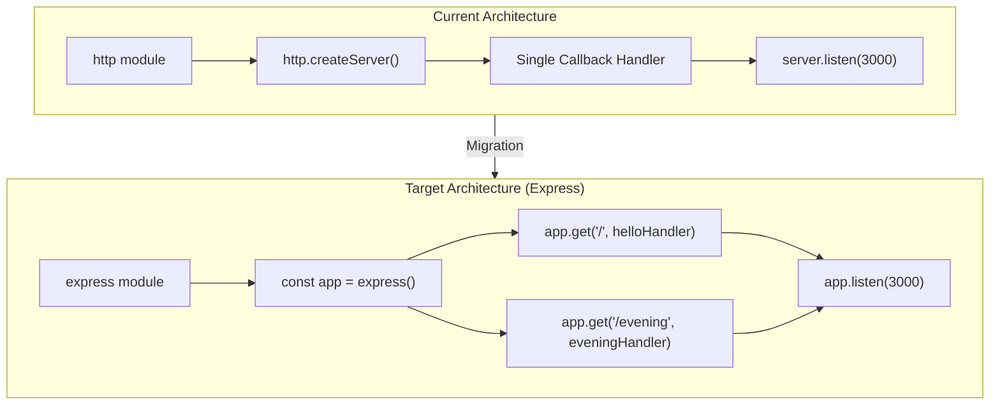

# Technical Specification

# 0. Agent Action Plan

## 0.1 Intent Clarification

### 0.1.1 Core Feature Objective

Based on the prompt, the Blitzy platform understands that the new feature requirement is to:

- **Integrate Express.js into an existing bare Node.js HTTP server project.** The repository (`hao-backprop-test`) currently hosts a single-file HTTP server (`server.js`, 14 lines) built exclusively on the Node.js built-in `http` module. The server listens on `127.0.0.1:3000` and returns a static `Hello, World!\n` response to every incoming request regardless of method or path. The user requests replacing this raw `http` module implementation with the Express.js web framework to gain structured routing capabilities.

- **Add a new HTTP endpoint that returns the response `"Good evening"`.** In addition to the framework migration, a second distinct route must be introduced. This route will serve a plain-text response body of `Good evening` when accessed. The existing "Hello world" behavior must continue to be served, now as an explicitly routed endpoint rather than a catch-all handler.

- **Implicit requirements detected:**
  - The existing `Hello, World!\n` response must be preserved on a defined route (the root path `/`) to maintain backward compatibility with any consumers or integration tests targeting the current server behavior.
  - The new `"Good evening"` endpoint requires a dedicated route path. Since the user did not specify one, a semantically appropriate path such as `/evening` will be assigned.
  - The `package.json` manifest must be updated to declare `express` as a production dependency.
  - The `package-lock.json` will be regenerated upon dependency installation.
  - A `start` script should be added to `package.json` for conventional project execution via `npm start`.
  - The `README.md` should be updated to reflect the new framework usage and available endpoints.

### 0.1.2 Special Instructions and Constraints

- **No specific architectural directives were provided by the user.** The instruction is a straightforward feature addition request. There are no requirements to integrate with authentication, maintain backward compatibility with external APIs, or follow specific design patterns beyond standard Express.js conventions.
- **Tutorial context:** The user describes this as a "tutorial" project, indicating the implementation should prioritize clarity, simplicity, and standard Express.js idioms suitable for learning purposes.
- **No version constraint specified:** The user stated "add expressjs" without specifying a version. The latest stable release (`express@5.2.1`) will be used, which is the current default on npm and requires Node.js >= 18 (satisfied by the project's Node.js v20.20.0 environment).
- **User Example (exact quote):** `"this is a tutorial of node js server hosting one endpoint that returns the response "Hello world". Could you add expressjs into the project and add another endpoint that return the response of "Good evening"?"`

### 0.1.3 Technical Interpretation

These feature requirements translate to the following technical implementation strategy:

- To **integrate Express.js**, we will modify `server.js` to replace the `http.createServer()` pattern with an Express application instance (`const app = express()`), converting the monolithic request handler into discrete route definitions.
- To **preserve the existing "Hello World" behavior**, we will create an Express route handler for `GET /` that responds with the same `Hello, World!\n` plain-text body currently served by the raw `http` handler.
- To **add the "Good evening" endpoint**, we will create a new Express route handler for `GET /evening` that responds with the plain-text body `Good evening`.
- To **register Express.js as a dependency**, we will modify `package.json` to include `express` in the `dependencies` field and regenerate `package-lock.json` via `npm install`.
- To **maintain project conventions**, we will add an `npm start` script in `package.json` pointing to `node server.js` and update `README.md` to document both endpoints.

## 0.2 Repository Scope Discovery

### 0.2.1 Comprehensive File Analysis

The repository is a flat, four-file Node.js project with zero subdirectories and zero npm dependencies. Every file in the repository is affected by this feature addition. The table below catalogs each existing file, its current role, and the required modification:

| File | Lines | Current Purpose | Modification Required | Impact Level |
|------|-------|-----------------|----------------------|--------------|
| `server.js` | 14 | Sole application runtime — bare `http` module server returning static `Hello, World!\n` | **Major rewrite** — replace `http.createServer()` with Express app, define route handlers for `GET /` and `GET /evening` | Critical |
| `package.json` | 11 | npm manifest — declares package identity, zero dependencies | **Modify** — add `express` to `dependencies`, add `start` script, update `description` | Critical |
| `package-lock.json` | 13 | Dependency lockfile — currently contains only root package entry | **Regenerate** — will be fully regenerated by `npm install express` to include the Express dependency tree | Critical |
| `README.md` | 2 | Project identity and description | **Modify** — update documentation to reflect Express.js usage and available endpoints | Low |

**Integration point discovery:**

- **API endpoints connecting to the feature:**
  - `GET /` — existing catch-all handler that must become an explicit Express route
  - `GET /evening` — new endpoint to be created
- **Server initialization:** The `http.createServer()` and `server.listen()` calls in `server.js` (lines 6–14) represent the sole integration point where Express replaces the raw `http` module
- **No database models, migrations, service classes, controllers, middleware, or interceptors exist** — the project has zero supporting infrastructure

### 0.2.2 Web Search Research Conducted

- **Express.js latest stable version:** Confirmed via npm registry that `express@5.2.1` is the latest release, published as the default `latest` tag on npm. Express 5 requires Node.js >= 18, which is satisfied by the project environment (Node.js v20.20.0).
- **Express 5 key changes:** Express 5 dropped support for Node.js versions before v18, updated route matching to `path-to-regexp@8.x` for ReDoS mitigation, added native async/await middleware support, and removed deprecated Express 3/4 API signatures.
- **Best practices for Express.js basic routing:** Standard pattern is `app.get(path, handler)` with `res.send()` for plain-text responses. No additional middleware is needed for this minimal use case.

### 0.2.3 New File Requirements

- **No new source files need to be created.** The feature addition is contained entirely within modifications to existing files. The repository's minimal, flat structure is preserved.
- **No new test files are required by the user's request.** The existing `package.json` contains only a placeholder test script (`echo "Error: no test specified" && exit 1`). No test framework is in use, and the user did not request test coverage.
- **No new configuration files are needed.** Express.js operates with in-code configuration for this minimal use case, requiring no external config files, `.env` files, or YAML manifests.

## 0.3 Dependency Inventory

### 0.3.1 Private and Public Packages

The project currently has **zero npm dependencies** (confirmed by both `package.json` and `package-lock.json`). This feature addition introduces a single new public dependency:

| Package Registry | Package Name | Version | Purpose | Status |
|-----------------|-------------|---------|---------|--------|
| npm | `express` | `^5.2.1` | Web framework providing structured routing, request/response abstraction, and middleware support — replaces the bare Node.js `http` module | **To be added** |

Express 5.2.1 brings the following transitive dependencies that will be resolved automatically by npm during installation:

| Transitive Dependency | Version | Role |
|----------------------|---------|------|
| `body-parser` | `^2.2.1` | Request body parsing (built into Express) |
| `router` | `^2.2.0` | Core routing engine |
| `accepts` | `^2.0.0` | Content negotiation |
| `send` | `^1.1.0` | Static file serving |
| `cookie` | `^0.7.1` | Cookie parsing |
| `qs` | `^6.14.0` | Query string parsing |
| `debug` | `^4.4.0` | Debug logging |
| `mime-types` | `^3.0.0` | MIME type resolution |
| `proxy-addr` | `^2.0.7` | Proxy address resolution |
| `etag` | `^1.8.1` | ETag generation |

**Runtime compatibility:** Express 5.2.1 requires `node >= 18`. The project environment runs Node.js v20.20.0, which fully satisfies this requirement.

### 0.3.2 Dependency Updates

**Import Updates:**

The sole file requiring import changes is `server.js`:

| File | Current Import | New Import | Reason |
|------|---------------|------------|--------|
| `server.js` | `const http = require('http');` | `const express = require('express');` | Replace bare `http` module with Express framework |

**External Reference Updates:**

| File | Update Required | Detail |
|------|----------------|--------|
| `package.json` | Add `dependencies` field | `"express": "^5.2.1"` must be added as the first production dependency |
| `package.json` | Add `start` script | `"start": "node server.js"` for conventional `npm start` execution |
| `package-lock.json` | Full regeneration | Running `npm install` will regenerate the lockfile to include the full Express dependency tree |
| `README.md` | Update project description | Document Express.js integration and available endpoints |

## 0.4 Integration Analysis

### 0.4.1 Existing Code Touchpoints

The integration scope is tightly contained within the existing four-file repository. The following touchpoints require direct modification:

**Direct modifications required:**

- **`server.js` (lines 1–14, entire file):** This is the sole application runtime and the primary integration target. The complete `http.createServer()` pattern must be replaced with an Express application. Specific changes:
  - Line 1: Replace `const http = require('http');` with `const express = require('express');`
  - Lines 3–4: The `hostname` and `port` constants may be simplified since Express's `app.listen()` accepts port directly
  - Lines 6–10: Replace the `http.createServer()` callback with Express route definitions:
    - `app.get('/', handler)` for the existing `Hello, World!\n` response
    - `app.get('/evening', handler)` for the new `Good evening` response
  - Lines 12–14: Replace `server.listen()` with `app.listen()` retaining the startup log callback

- **`package.json` (lines 1–11):** The manifest must be extended with a `dependencies` block and a `start` script. No existing fields are removed; this is an additive modification.

- **`README.md` (lines 1–2):** Documentation should be expanded to describe the Express.js server and its two endpoints.

**Dependency injections:** Not applicable — the project has no dependency injection container, service locator, or IoC pattern.

**Database/Schema updates:** Not applicable — the project is entirely stateless with no database.

### 0.4.2 Integration Flow

The following diagram illustrates how the Express framework replaces the current bare `http` module integration:



### 0.4.3 Behavioral Mapping

The integration must preserve existing behavior while extending it with the new endpoint:

| Behavior | Before (bare `http`) | After (Express) |
|----------|---------------------|-----------------|
| `GET /` | Returns `200`, `text/plain`, `Hello, World!\n` | Returns `200`, `text/plain`, `Hello, World!\n` (identical) |
| `GET /evening` | Returns `200`, `text/plain`, `Hello, World!\n` (catch-all) | Returns `200`, `text/plain`, `Good evening` (new route) |
| `GET /anything-else` | Returns `200`, `text/plain`, `Hello, World!\n` (catch-all) | Returns `404` (Express default — no matching route) |
| Server binding | `127.0.0.1:3000` | Port `3000` (Express defaults to all interfaces via `0.0.0.0`, or can be configured to match) |
| Startup log | `Server running at http://127.0.0.1:3000/` | `Server running at http://localhost:3000/` (or equivalent) |

## 0.5 Technical Implementation

### 0.5.1 File-by-File Execution Plan

Every file listed below MUST be created or modified to complete this feature addition. Files are grouped by priority and dependency order.

**Group 1 — Dependency Registration (execute first):**

- **MODIFY: `package.json`** — Add `express@^5.2.1` to a new `dependencies` field, add a `start` script (`"start": "node server.js"`), and update the `description` to reflect Express.js usage. The `main` field currently points to `index.js` (which does not exist); this should be corrected to `server.js`.
- **REGENERATE: `package-lock.json`** — Regenerated automatically by running `npm install` after `package.json` is updated. The lockfile will expand from 13 lines (root-only) to include the full Express dependency tree.

**Group 2 — Core Feature Implementation (execute after dependencies are installed):**

- **MODIFY: `server.js`** — Complete rewrite of the 14-line file to replace the bare `http` module server with an Express application. Specific changes:
  - Replace `require('http')` with `require('express')`
  - Replace `http.createServer(callback)` with `express()` app instantiation
  - Define `GET /` route handler returning `Hello, World!\n` (preserving existing response)
  - Define `GET /evening` route handler returning `Good evening` (new feature)
  - Replace `server.listen()` with `app.listen()` on port `3000` with startup log callback

**Group 3 — Documentation (execute last):**

- **MODIFY: `README.md`** — Update the project documentation to describe Express.js integration, list available endpoints (`GET /` and `GET /evening`), and provide instructions for running the server (`npm install` followed by `npm start` or `node server.js`).

### 0.5.2 Implementation Approach per File

**`server.js` — Express migration and new endpoint:**

The transformed `server.js` follows the standard Express.js minimal application pattern:

```javascript
const express = require('express');
const app = express();
```

Two route handlers are registered — one preserving the original behavior and one implementing the new feature:

```javascript
app.get('/', (req, res) => { res.send('Hello, World!\n'); });
app.get('/evening', (req, res) => { res.send('Good evening'); });
```

The server starts listening with a startup confirmation log:

```javascript
app.listen(3000, () => { console.log('Server running at http://localhost:3000/'); });
```

**`package.json` — Dependency and script registration:**

The `dependencies` block is added alongside the existing fields:

```json
"dependencies": { "express": "^5.2.1" }
```

The `scripts` block is extended with a `start` command, and the `main` field is corrected:

```json
"main": "server.js",
"scripts": { "start": "node server.js", "test": "echo \"Error: no test specified\" && exit 1" }
```

**`README.md` — Documentation update:**

The README is expanded to include a project description, installation instructions (`npm install`), a startup command (`npm start`), and a table listing both available endpoints with their response descriptions.

### 0.5.3 User Interface Design

Not applicable — this project is a backend-only HTTP server with no user interface, frontend layer, or browser-rendered content. Both endpoints return plain-text responses consumed by HTTP clients programmatically.

## 0.6 Scope Boundaries

### 0.6.1 Exhaustively In Scope

The following files and components constitute the complete, exhaustive scope of this feature addition. Every item listed MUST be addressed during implementation:

**Application source files:**
- `server.js` — Complete rewrite to Express.js framework (replace `http` module, add route definitions for `GET /` and `GET /evening`, update server startup)

**Dependency manifests:**
- `package.json` — Add `express@^5.2.1` dependency, add `start` script, correct `main` field to `server.js`, update `description`
- `package-lock.json` — Full regeneration via `npm install` to reflect Express dependency tree

**Documentation:**
- `README.md` — Update project description, document endpoints, add installation and run instructions

**Route definitions (within `server.js`):**
- `GET /` — Existing "Hello, World!" response preserved as explicit Express route
- `GET /evening` — New endpoint returning "Good evening" response

**Runtime configuration (within `server.js`):**
- Port: `3000` (preserved from current implementation)
- Startup logging: Console confirmation message on successful server binding

### 0.6.2 Explicitly Out of Scope

The following items are deliberately excluded from this feature addition:

- **Test infrastructure** — No test framework, test files, or test coverage is included. The existing placeholder test script in `package.json` is not modified beyond its current state.
- **Middleware stack** — No additional Express middleware (e.g., `cors`, `helmet`, `morgan`, `compression`) is introduced. The feature uses Express's built-in capabilities only.
- **Error handling middleware** — No custom Express error handler is added; Express 5 default error behavior applies.
- **Environment configuration** — No `.env` files, environment variable management, or configuration files are introduced. Port and other settings remain hardcoded as in the original implementation.
- **Docker / containerization** — No `Dockerfile`, `docker-compose.yml`, or container configuration is created.
- **CI/CD pipeline** — No GitHub Actions, Jenkins, or other CI/CD configuration is added.
- **TypeScript migration** — The project remains in plain JavaScript with CommonJS modules.
- **Process management** — No PM2, nodemon, or other process manager configuration is introduced.
- **Database or persistent storage** — The project remains fully stateless.
- **Additional endpoints** — Only the two endpoints specified (`GET /` and `GET /evening`) are implemented. No health check, status, or other utility endpoints are added.
- **Performance optimization** — No clustering, load balancing, or caching is introduced.
- **Security hardening** — No HTTPS, rate limiting, input validation, or security headers are configured beyond Express 5 defaults.

## 0.7 Rules for Feature Addition

### 0.7.1 Feature-Specific Rules

The following rules govern the implementation of this feature addition, derived from the user's requirements and the existing project conventions:

- **Preserve existing endpoint behavior:** The `GET /` route must return an identical response to the current bare `http` server — status `200`, content type `text/plain`, body `Hello, World!\n`. The Express migration must not alter this observable behavior for any consumer of the root endpoint.

- **Exact response text for new endpoint:** The `GET /evening` route must return the response body `Good evening` exactly as specified by the user, with status `200` and content type `text/plain`.

- **Maintain port binding:** The server must continue to listen on port `3000`, consistent with the current implementation. No port changes or dynamic port assignment are permitted.

- **Use standard Express.js idioms:** As the user described this as a "tutorial" project, the implementation must follow well-established Express.js patterns that are clear, readable, and consistent with official Express documentation. This includes using `app.get()` for route registration and `res.send()` for response delivery.

- **CommonJS module system:** The project uses `require()` for module imports (established in the existing `server.js`). This convention must be maintained. Do not convert to ES Modules (`import`/`export`) syntax.

- **Minimal dependency footprint:** Only `express` is added as a dependency. No additional packages, utilities, or middleware are introduced unless strictly necessary for the two specified endpoints.

- **Flat file structure preserved:** No new directories or nested folder structures are created. The project's flat, four-file layout in the repository root is maintained.

## 0.8 References

### 0.8.1 Repository Files and Folders Searched

The following files and folders were comprehensively searched and analyzed to derive the conclusions in this Agent Action Plan:

| Path | Type | Lines | Purpose of Inspection |
|------|------|-------|----------------------|
| `""` (repository root) | Folder | — | Enumerated all four files; confirmed flat directory structure with zero subdirectories |
| `server.js` | File | 14 | Full content review — identified `http.createServer()` pattern, hardcoded hostname/port, static response handler, and startup logging as the complete application runtime |
| `package.json` | File | 11 | Full content review — confirmed zero dependencies, placeholder test script, `main` pointing to non-existent `index.js`, author `hxu`, MIT license |
| `package-lock.json` | File | 13 | Full content review — confirmed lockfileVersion 3 (npm v9+), empty dependency graph with only root package entry |
| `README.md` | File | 2 | Full content review — confirmed project identity (`hao-backprop-test`) and description ("test project for backprop integration. Do not touch!") |

### 0.8.2 Technical Specification Sections Reviewed

| Section | Key Information Extracted |
|---------|-------------------------|
| 1.1 Executive Summary | Project is a minimal Node.js test fixture for Backprop integration; 4 files, 40 total lines |
| 1.2 System Overview | Zero-dependency, single-file architecture; `http` module only; `127.0.0.1:3000` binding |
| 2.1 Feature Catalog | Three features cataloged: F-001 (HTTP Server), F-002 (Startup Logging), F-003 (Backprop Test Fixture) |
| 3.1 Programming Languages | JavaScript ES6+ with CommonJS `require()`; no TypeScript; lockfileVersion 3 indicates Node.js 18+ creation environment |
| 3.2 Frameworks & Libraries | Zero frameworks — bare `http` module only; explicit note that Express/Koa/Fastify are not used |
| 3.3 Open Source Dependencies | Zero npm dependencies confirmed in both `package.json` and `package-lock.json` |
| 5.1 High-Level Architecture | Zero-dependency, single-file monolithic architecture; deterministic behavior; loopback isolation |
| Node.js Built-in `http` Module | Documents `http.createServer()` and `server.listen()` as the sole library APIs used |
| 6.1 Core Services Architecture | Confirms no microservices, no distributed components, no inter-service communication |

### 0.8.3 External Research Conducted

| Query | Source | Key Finding |
|-------|--------|------------|
| Express.js latest stable version | npm registry (`npm view express version`) | Latest stable version: `5.2.1`; requires `node >= 18` |
| Express.js release history | GitHub releases (`expressjs/express`) | Express 5.0 released October 2024; Express 5.1.0 became npm `latest` tag in March 2025 |
| Express 5 migration details | expressjs.com, InfoQ, npm | Express 5 dropped Node.js < 18 support, updated path-to-regexp for security, added async/await middleware support |

### 0.8.4 Attachments

No attachments were provided for this project. No Figma URLs, design files, or supplementary documents were referenced.

